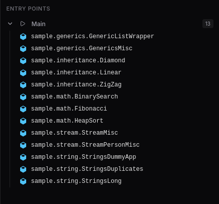
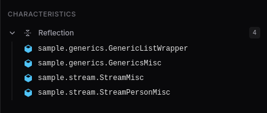
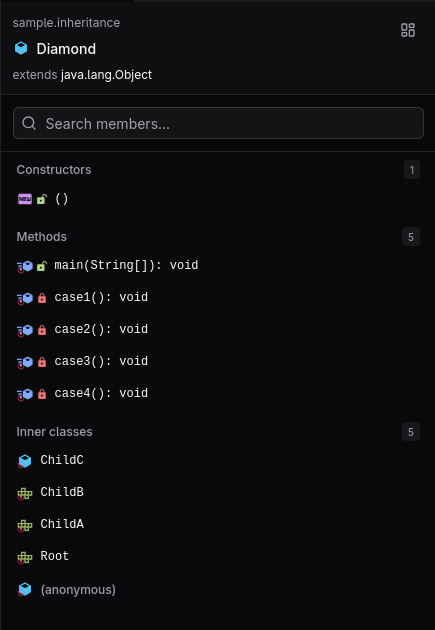

slicer provides a structural overview of a class file or the entire workspace. These two views can be toggled at will using the button in the right-top corner of the pane.

The structure view is useful for quickly getting a general idea of a class file's structure, especially when disassemblers fail to process it correctly.

## Workspace

The workspace structure view displays the size of the workspace and lists classes of interest, such as those containing a main method or similar.

It also shows "characteristics" of the workspace, such as the presence of reflective calls, which can be useful for quickly identifying obfuscated code.

### Entry points

The entry points structure view lists all entry points in the class file, such as those containing the main method, premain method and others:

| Name              | Description                                                                                                                                                    |
| ----------------- | -------------------------------------------------------------------------------------------------------------------------------------------------------------- |
| Main              | A class containing a `public static void main(String[] args)` method.                                                                                          |
| Java agent        | A class containing a `public static void premain(String[] args[, Instrumentation main])` method.                                                               |
| Bukkit plugin     | A class extending the `org.bukkit.plugin.java.JavaPlugin` class.                                                                                               |
| BungeeCord plugin | A class extending the `net.md_5.bungee.api.plugin.Plugin` class.                                                                                               |
| Velocity plugin   | A class annotated with the `com.velocitypowered.api.plugin.Plugin` annotation.                                                                                 |
| Forge mod         | A class annotated with the `net.minecraftforge.fml.common.Mod` annotation.                                                                                     |
| Fabric mod        | A class implementing the `net.fabricmc.api.ModInitializer`, `net.fabricmc.api.ClientModInitializer` or `net.fabricmc.api.DedicatedServerModInitializer` class. |

### Characteristics

The characteristics structure view lists all characteristics of the workspace, such as the presence of reflective calls, foreign memory access and more:

| Name                 | Description                                                                                                                                                                        |
| -------------------- | ---------------------------------------------------------------------------------------------------------------------------------------------------------------------------------- |
| Class loading        | One or more classes use the `java.lang.ClassLoader` API.                                                                                                                           |
| Encryption           | One or more classes use the `javax.crypto.Cipher` API.                                                                                                                             |
| File I/O             | One or more classes use the `java.io` or `java.nio.file` API.                                                                                                                      |
| Network I/O          | One or more classes use the `java.net` or `java.nio.channels` API.                                                                                                                 |
| Object serialization | One or more classes use the `java.io.Object[Input/Output]Stream` API.                                                                                                              |
| Reflection           | One or more classes reference classes from the `java.lang.reflect` or `java.lang.invoke` API.                                                                                      |
| FFM/native methods   | One or more classes contain native methods or use classes for facilitating foreign memory access, such as `java.lang.foreign.MemorySegment` and `java.lang.foreign.MemoryAddress`. |
| Process manipulation | One or more classes use the `java.lang.Process(Builder/Handle)` or `java.lang.Runtime#exec` API.                                                                                   |

## Class

The class structure view lists all members of the class file, such as fields, methods, constructors, initializers and inner classes.

It automatically displays information about the class file open in the primary center position.

